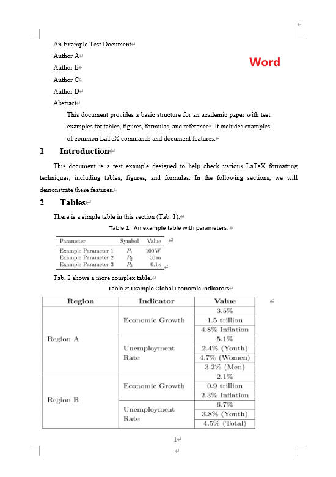
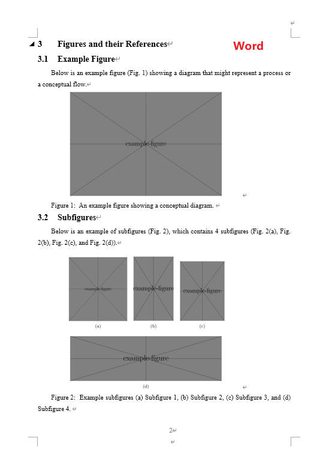
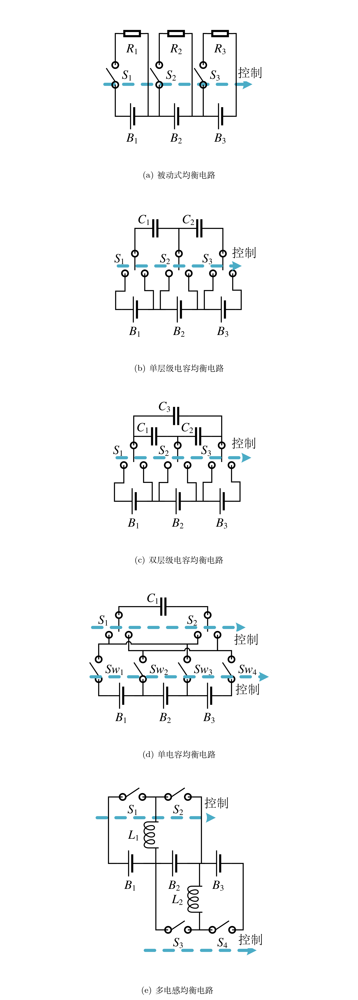

# LaTeX to Word Conversion Tool

[简体中文](./README_zh.md)

In daily work, colleagues or supervisors unfamiliar with LaTeX may request Word documents for review and collaboration. This project provides a Python script that uses Pandoc and Pandoc-Crossref to automatically convert LaTeX files into Word documents following a specified format. Although there's no perfect method for converting LaTeX to Word, the output generated by this project meets informal review needs. However, around 5% of the content (such as author information) may require manual corrections post-conversion.

## Features

- Supports formula conversion
- Automatically numbers and cross-references images, tables, formulas, and citations
- Converts multi-figure LaTeX files
- Outputs Word files in a specified format
- Supports Chinese

Examples are shown below; more results are in `tests`:

<p align="center">
  
  
</p>

## Quick Start

Ensure Pandoc and Pandoc-Crossref are correctly installed (see [Install Dependencies](#install-dependencies)). Execute the following command in your terminal:

```shell
python ./tex2docx/tex2docx.py --input_texfile <your_texfile> --multifig_dir <dir_saving_temporary_figs> --output_docxfile <your_docxfile> --reference_docfile <your_reference_docfile> --bibfile <your_bibfile> --cslfile <your_cslfile>
```

Replace `<...>` with appropriate file paths or folder names.

## Install Dependencies

Ensure you have installed Pandoc, Pandoc-Crossref, and related Python libraries.

### Pandoc

Install Pandoc as described in the [official documentation](https://github.com/jgm/pandoc/blob/main/INSTALL.md). It is recommended to download the latest release from [Pandoc Releases](https://github.com/jgm/pandoc/releases).

### Pandoc-Crossref

Install Pandoc-Crossref by following the [official documentation](https://github.com/lierdakil/pandoc-crossref). Ensure compatibility between Pandoc and Pandoc-Crossref and configure the path correctly.

### Python Libraries

Install locally:

```shell
pip install -e .
```

Or install from PyPI:

```shell
pip install tex2docx
```

## Usage and Examples

This tool supports both command-line and script-based usage. Ensure the required dependencies are installed.

### Command-Line Usage

Run the following command in your terminal:

```shell
convert --input-texfile <your_texfile> --multifig-dir <dir_saving_temporary_figs> --output-docxfile <your_docxfile> --reference-docfile <your_reference_docfile> --bibfile <your_bibfile> --cslfile <your_cslfile>
```

Use `convert --help` to see details on these parameters.

For example, using `tests/en`:

```shell
convert --input-texfile ./tests/en/main.tex --multifig-dir ./tests/en/multifigs --output-docxfile ./tests/en/main_cli.docx --reference-docfile ./my_temp.docx --bibfile ./tests/ref.bib --cslfile ./ieee.csl
```

This will generate the Word file `main_cli.docx` in the `tests/en` directory.

### Script Usage

```python
from tex2docx import LatexToWordConverter

config = {
    'input_texfile': '<your_texfile>',
    'output_docxfile': '<your_docxfile>',
    'multifig_dir': '<dir_saving_temporary_figs>',
    'reference_docfile': '<your_reference_docfile>',
    'cslfile': '<your_cslfile>',
    'bibfile': '<your_bibfile>',
    'debug': False
}

converter = LatexToWordConverter(**config)
converter.convert()
```

For more examples, refer to `tests/test_tex2docx.py`.

## FAQ

1. **Inconsistent Multi-Figure Layout**  
   The relative positions of sub-figures may differ between LaTeX compilation and Word conversion, as shown below:

   <p align="center">
     
     
   </p>

   This may result from redefined page size or parameters in the LaTeX file. To address this, adjust the `MULTIFIG_TEXFILE_TEMPLATE` variable. Below is an example for reference:

   ```python
   import tex2docx

   my_multifig_texfile_template = r"""
   \documentclass[preview,convert,convert={outext=.png,command=\unexpanded{pdftocairo -r 600 -png \infile}}]{standalone}
   \usepackage{graphicx}
   \usepackage{subfig}
   \usepackage{xeCJK}
   \usepackage{geometry}
   \newgeometry{
       top=25.4mm, bottom=33.3mm, left=20mm, right=20mm,
       headsep=10.4mm, headheight=5mm, footskip=7.9mm,
   }
   \graphicspath{{%s}}

   \begin{document}
   \thispagestyle{empty}
   %s
   \end{document}
   """

   config = {
       'input_texfile': 'tests/en/main.tex',
       'output_docxfile': 'tests/en/main.docx',
       'multifig_dir': 'tests/en/multifigs',
       'reference_docfile': 'my_temp.docx',
       'cslfile': 'ieee.csl',
       'bibfile': 'tests/ref.bib',
       'multifig_texfile_template': my_multifig_texfile_template,
   }

   converter = tex2docx.LatexToWordConverter(**config)
   converter.convert()
   ```

2. **The Word Output Doesn't Meet Formatting Requirements**  
   Use Word's style management tools to adjust the styles in `my_temp.docx`.

## Implementation Details

This project relies on Pandoc and Pandoc-Crossref to convert LaTeX files to Word documents. The core command used is:

```shell
pandoc texfile -o docxfile \
    --lua-filter resolve_equation_labels.lua \
    --filter pandoc-crossref \
    --reference-doc=temp.docx \
    --number-sections \
    -M autoEqnLabels \
    -M tableEqns \
    -M reference-section-title=Reference \
    --bibliography=ref.bib \
    --citeproc --csl ieee.csl \
    -t docx+native_numbering
```

1. `--lua-filter resolve_equation_labels.lua` handles equation numbering and cross-references, inspired by [Constantin Ahlmann-Eltze's script](https://gist.github.com/const-ae/752ad85c43d92b72865453ea3a77e2dd).
2. `--filter pandoc-crossref` handles cross-references for other elements.
3. `--reference-doc=my_temp.docx` applies the styles from `my_temp.docx` to the generated Word file. Two template files are included: `TIE-temp.docx` (for TIE journal submission, double-column format) and `my_temp.docx` (single-column, designed for easier annotation).
4. `--number-sections` adds numbering to section headings.
5. `-M autoEqnLabels`, `-M tableEqns` enable automatic numbering of equations and tables.
6. `-M reference-section-title=Reference` adds a section title for references.
7. `--bibliography=my_ref.bib` generates the bibliography from `ref.bib`.
8. `--citeproc --csl ieee.csl` formats citations and the bibliography using the IEEE citation style.
9. `-t docx+native_numbering` improves captions for images and tables.

The conversion for multi-figure LaTeX content may not be perfect. This project extracts multi-figure code from the LaTeX file and uses the `convert` and `pdftocairo` tools to compile the figures into a single large PNG file, replacing the original LaTeX image code and updating references to ensure smooth import into Word.

## Known Issues

1. Captions for figures and tables in Chinese still start with "Figure" and "Table".
2. Author information is not fully converted.

## Changelog

### v1.2.0

1. Fixed module import issues, improving stability.
2. Enhanced the command-line tool for a more intuitive and efficient user experience.
3. Switched to `pyproject.toml` for dependency management, replacing `setup.py`.
4. Released on PyPI; users can install via `pip install tex2docx`.

## Miscellaneous

There are two kinds of people: those who use LaTeX and those who don't. The latter often ask the former for a Word version. Hence, the following command:

```bash
pandoc input.tex -o output.docx\
  --filter pandoc-crossref \
  --reference-doc=my_temp.docx \
  --number-sections \
  -M autoEqnLabels -M tableEqns \
  -M reference-section-title=Reference \
  --bibliography=my_ref.bib \
  --citeproc --csl ieee.csl \
  -t docx+native_numbering
```