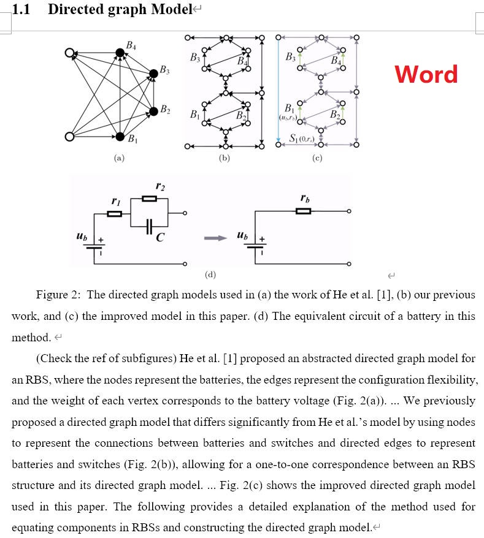
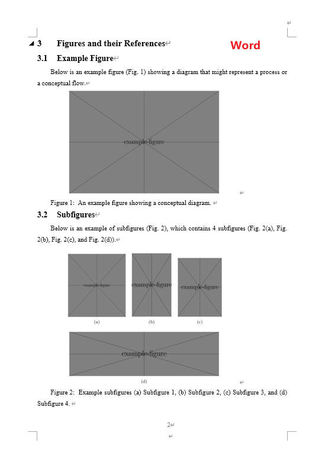
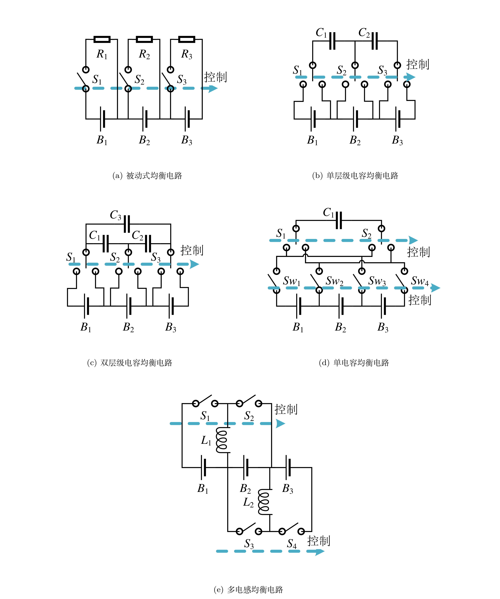
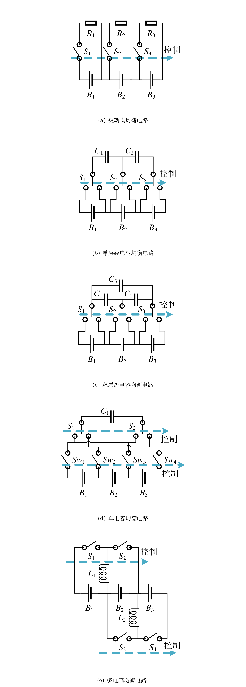

# LaTeX 到 Word 文件转换工具

日常工作中，不熟悉 LaTeX 的上级或同事常会要求提供 Word 文件，以便共同审阅和修改。
本项目提供一个 Python 脚本，利用 Pandoc 和 Pandoc-Crossref 工具，将 LaTeX 文件自动地按照指定格式转换为 Word 文件。
需要说明的是，目前仍没有完美将 LaTeX 转换为 Word 的方法，本项目生成的 Word 文件可满足非正式的审阅需求，其中约 5% 的内容（如作者信息等非正文内容）可能需要在转换后手动更正。

## 特性

- 支持公式的转换
- 支持图片、表格、公式和参考文献的自动编号及交叉引用
- 支持多子图的转换
- 支持按照指定格式输出 Word
- 支持中文

效果如下，更多的结果请看 `tests` ：

<p align="center">
  
  
</p>


## 快速使用

确保已正确安装 Pandoc 和 Pandoc-Crossref 等依赖，详见[安装依赖](#安装依赖)。在命令行中执行以下命令：

```shell
python ./tex2docx/tex2docx.py --input_texfile <your_texfile> --multifig_dir <dir_saving_temporary_figs> --output_docxfile <your_docxfile> --reference_docfile <your_reference_docfile> --bibfile <your_bibfile> --cslfile <your_cslfile>
```

将命令中的 `<...>` 替换为相应文件路径或文件夹名称即可。

## 安装依赖

需要安装 Pandoc、Pandoc-Crossref 和相关 Python 库。

### Pandoc

安装 Pandoc，详见 [Pandoc 官方文档](https://github.com/jgm/pandoc/blob/main/INSTALL.md)。建议从 [Pandoc Releases](https://github.com/jgm/pandoc/releases) 下载最新的安装包。

### Pandoc-Crossref

安装 Pandoc-Crossref，详见 [Pandoc-Crossref 官方文档](https://github.com/lierdakil/pandoc-crossref)。确保下载与 Pandoc 版本相匹配的 Pandoc-Crossref，并适当配置路径。

### 相关 Python 库

本地安装：

```shell
pip install -e .
```

或者从 PyPI 安装：

```shell
pip install tex2docx
```

## 使用说明及案例

支持命令行和脚本两种使用方式，确保已安装所需依赖。

### 命令行方式

在终端执行以下命令：

```shell
convert --input-texfile <your_texfile> --multifig-dir <dir_saving_temporary_figs> --output-docxfile <your_docxfile> --reference-docfile <your_reference_docfile> --bibfile <your_bibfile> --cslfile <your_cslfile>
```

使用 `convert --help` 查看上述参数的说明。

以 `tests/en` 测试案例为例，在仓库目录下执行如下命令：

```shell
convert --input-texfile ./tests/en/main.tex --multifig-dir ./tests/en/multifigs --output-docxfile ./tests/en/main_cli.docx --reference-docfile ./my_temp.docx --bibfile ./tests/ref.bib --cslfile ./ieee.csl
```
则可以在 `tests/en` 目录下找到转换后的 `main_cli.docx` 文件。

### 脚本方式

```python
from tex2docx import LatexToWordConverter

config = {
    'input_texfile': '<your_texfile>',
    'output_docxfile': '<your_docxfile>',
    'multifig_dir': '<dir_saving_temporary_figs>',
    'reference_docfile': '<your_reference_docfile>',
    'cslfile': '<your_cslfile>',
    'bibfile': '<your_bibfile>',
    'debug': False
}

converter = LatexToWordConverter(**config)
converter.convert()
```

案例可以参考`tests/test_tex2docx.py`。

## 常见问题

1. 多子图相对位置与原始 tex 文件编译结果不同，如以下两张图

<p align="center">
  
  
</p>

可能是因为原始 tex 文件重新定义了页面尺寸等参数，需要将相关 tex 代码添加到 `MULTIFIG_TEXFILE_TEMPLATE` 变量中。以下为一个示例，请根据实际情况修改：
```python
import tex2docx

my_multifig_texfile_template = r"""
\documentclass[preview,convert,convert={outext=.png,command=\unexpanded{pdftocairo -r 600 -png \infile}}]{standalone}
\usepackage{graphicx}
\usepackage{subfig}
\usepackage{xeCJK}
\usepackage{geometry}
\newgeometry{
    top=25.4mm, bottom=33.3mm, left=20mm, right=20mm,
    headsep=10.4mm, headheight=5mm, footskip=7.9mm,
}
\graphicspath{{%s}}

\begin{document}
\thispagestyle{empty}
%s
\end{document}
"""

config = {
    'input_texfile': 'tests/en/main.tex',
    'output_docxfile': 'tests/en/main.docx',
    'multifig_dir': 'tests/en/multifigs',
    'reference_docfile': 'my_temp.docx',
    'cslfile': 'ieee.csl',
    'bibfile': 'tests/ref.bib',
    'multifig_texfile_template': my_multifig_texfile_template,
}

converter = tex2docx.LatexToWordConverter(**config)
converter.convert()
```

1. 输出 Word 文件的格式仍不满足需求

利用 Word 的样式管理，修改 `my_temp.docx` 文件中的样式。

## 实现原理

该项目核心是使用 Pandoc 和 Pandoc-Crossref 工具实现 LaTeX 到 Word 的转换，具体配置如下：

```shell
pandoc texfile -o docxfile \
    --lua-filter resolve_equation_labels.lua \
    --filter pandoc-crossref \
    --reference-doc=temp.docx \
    --number-sections \
    -M autoEqnLabels \
    -M tableEqns \
    -M reference-section-title=Reference \
    --bibliography=ref.bib \
    --citeproc --csl ieee.csl \
    -t docx+native_numbering
```

其中，
1. `--lua-filter resolve_equation_labels.lua` 处理公式编号及公式交叉引用，受 Constantin Ahlmann-Eltze 的[脚本](https://gist.githubusercontent.com/const-ae/752ad85c43d92b72865453ea3a77e2dd/raw/28c1815979e5d03cd9ab3638f9befd354797a72b/resolve_equation_labels.lua)启发；
2. `--filter pandoc-crossref` 处理除公式以外的交叉引用；
3. `--reference-doc=my_temp.docx` 依照 `my_temp.docx` 中的样式生成 Word 文件。本仓库提供了两个模板文件 `TIE-temp.docx` 和 `my_temp.docx`，前者是 TIE 期刊的投稿 Word 模板（双栏），后者是个人调整出的 Word 模板（单栏，且便于批注）；
4. `--number-sections` 在（子）章节标题前添加数字编号；
5. `-M autoEqnLabels`， `-M tableEqns`设置公式、表格等的编号；
6. `-M reference-sction-title=Reference` 在参考文献部分添加章节标题 Reference；
7. `--biblipgraphy=my_ref.bib` 使用 `ref.bib` 生成参考文献；
8. `--citeproc --csl ieee.csl` 生成的参考文献格式为 `ieee` ；
9. `-t docx+native_numbering` 优化图片和表格的 caption。

然而，上述方法对多子图转换效果不佳。
本项目通过提取 LaTeX 文件中的多子图代码，并利用 LaTeX 的 `convert` 与 `pdftocairo` 工具自动编译这些图片为单一大图 PNG 文件。然后，这些 PNG 文件将替代原始 LaTeX 文档中的相应图片代码，并更新相关引用，确保多子图图片能顺利导入。


## 遗留问题

1. 中文的图表 caption 仍以 Fiugre 和 Table 开头；
2. 作者信息无法完整转换。

## 更新记录

### v1.2.0

1. 修复了模块导入问题，提升了稳定性。
2. 改进了命令行工具的使用体验，使其更加直观和高效。
3. 采用了 pyproject.toml 进行依赖管理，弃用了 setup.py。
4. 正式在 PyPI 上发布，用户可通过 pip install tex2docx 进行安装。

## 其他

世界上有两种人，一种人会用 Latex，另一种人不会用 Latex。 后者常常向前者索要 Word 版本文件。 因此有了如下一行命令。

```bash
pandoc input.tex -o output.docx\
  --filter pandoc-crossref \
  --reference-doc=my_temp.docx \
  --number-sections \
  -M autoEqnLabels -M tableEqns \
  -M reference-section-title=Reference \
  --bibliography=my_ref.bib \
  --citeproc --csl ieee.csl \
  -t docx+native_numbering
```